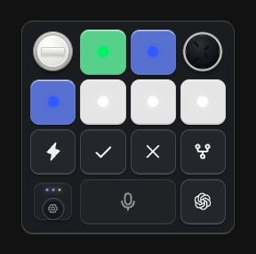
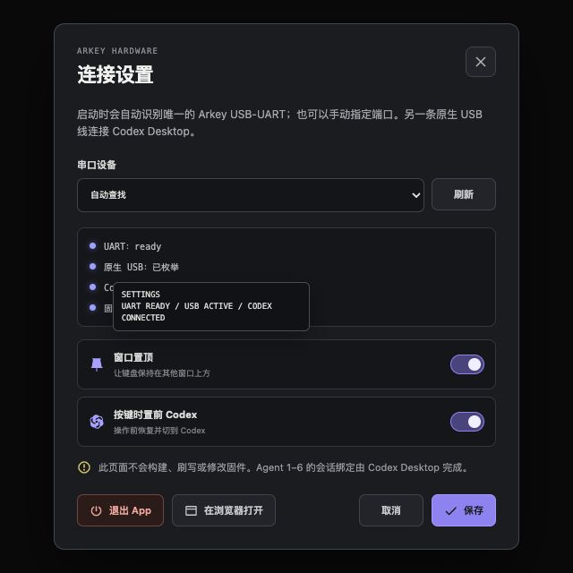

# Arkey Web

Arkey 用一个本机 Web 控制面、Tauri 桌面 App 和 ESP32-S3 开发板复现 Codex Micro 的固定实体输入链路：

```text
Web 按键 → Rust / Node localhost bridge → native USB CDC ┐
Codex Desktop ↔ native USB HID report 0x06 ──────────────┼══ 一根 native USB 线 ══ ESP32-S3
Web ← 六槽灯光状态 ← Rust / Node bridge ← USB CDC ───────┘
```

当前固件版本是 `0.2.0-arkey-esp32s3-lab`。native USB 以 HID + CDC 复合设备枚举，同一根线同时供电、连接 Codex Desktop 并承载 Web 固定语义控制。板载 CH343P COM 口只用于手动写入和恢复，不参与日常运行。

## 项目来源与致谢

Arkey Web 是基于 [shuhari04/arkey](https://github.com/shuhari04/arkey) 继续开发的派生项目，并非从零开始。感谢原作者公开 Arkey 以及其中的 Codex Micro Lab 研究与实现；本项目继承并改造了上游对当前 Codex Micro 实验兼容面的理解，包括 native HID report、固定控制语义和六个 Agent 槽位状态。

本分支将上游的 QMK/Keychron 实验路径改造成独立 ESP32-S3 开发板，并用 React 控制面与本机 Rust/Node USB CDC 桥取代原来的 macOS 客户端与 App Server 主链路。为保持项目目标清晰，当前仓库不再包含上游的 QMK 固件、Swift 客户端或 Codex App Server daemon；需要这些能力时，请直接查看[原始 Arkey 项目](https://github.com/shuhari04/arkey)。详细继承边界和许可说明见[第三方通知](docs/legal/THIRD_PARTY_NOTICES.md)。

> [!WARNING]
> 本项目是非官方、仅用于自有硬件互操作研究的实验。固件会呈现当前实验观察到的 USB 身份和 HID 行为；它不是 OpenAI 或 Work Louder 支持的接口，Desktop 更新后可能失效。不要销售或把写入该固件的设备描述成官方 Codex Micro。

## 演示

https://github.com/user-attachments/assets/3419718e-9f44-4e9f-adee-0728bfc62102

[观看或下载 Arkey Web 与 Codex Desktop 联动演示（MP4）](docs/assets/arkey-web-demo.mp4)

视频展示了通过 Web 控制面触发实体输入后，Codex Desktop 中对应 Agent 槽位的状态联动和定时任务效果。

## 仓库范围

- `firmware/esp32s3-codex-micro-lab`：ESP32-S3 固件源码、协议测试和固定依赖。
- `scripts/build-codex-micro-esp32s3-lab.sh`：只构建固件，不打开串口、不刷写。
- `scripts/test-codex-micro-esp32s3-protocol.sh`：本机 C 协议测试。
- `src/microbridge.ts`：Web 与开发板 native USB CDC 接口之间的最小控制桥。
- `src/webserver.ts`：只监听 `127.0.0.1` 的静态服务和硬件 API。
- `apps/ArkeyWeb`：实体键盘控制面、USB 控制设备设置，以及内置 Rust localhost/CDC 桥的 Tauri App。
- `docs/ARCHITECTURE.md`：当前 Web、Tauri、Node 与复合 native USB 的组件边界。
- `docs/FIRMWARE.md`：备份、构建、版本核对、手动写入和恢复说明。

仓库不再包含 QMK、Keychron 固件、Codex App Server daemon、macOS Swift 客户端、Virtual Lab 或 GitHub CI。

## 启动桌面 App

要求 Node.js 20、Rust stable，以及当前平台的 [Tauri 系统依赖](https://v2.tauri.app/start/prerequisites/)：

```bash
npm ci
npm run app
```

App 默认显示 288×285 的无边框透明小键盘窗口，键盘外侧透明留白可以拖动窗口。打开连接设置时，窗口会记住当前位置并居中展开；关闭、取消或保存设置后恢复原位置和尺寸。窗口置顶开关和“退出 App”都在设置页，紧凑态不叠加系统按钮。

### App 界面

| 主界面 | 连接设置 |
| --- | --- |
|  |  |

macOS 版另有“按键时置前 Codex”开关，默认关闭。开启时 Arkey 会请求系统“辅助功能”权限；授权后，每个有效控制事件都会先恢复并激活 bundle id 为 `com.openai.codex` 的 Codex Desktop，再发送原有固定硬件语义。授权尚未完成或 Codex 未运行时不会阻断按键事件。普通浏览器版不能申请或修改这项权限；从 App 打开的共享浏览器会沿用 App 中已经保存的开关状态。

桌面 App 不依赖 Node 服务。Rust 会监听系统分配的随机 `127.0.0.1` 端口，提供内置 Web 资源、固定硬件 API 和唯一的 USB CDC 控制桥。WebView 用一次性启动令牌换取 HttpOnly SameSite 会话；令牌使用后立即失效，所有静态资源和 API 都要求该会话。普通浏览器即使猜到端口也不能直接使用控制面。

需要同时使用浏览器时，在 App 的连接设置里点击“在浏览器打开”。App 会为默认浏览器生成另一个一次性会话；App WebView、浏览器窗口和后续标签页都调用同一个 Rust bridge，因此只占用一次 CDC 端口。桌面 App 也是单实例，重复启动只会聚焦已有窗口。不要在 App 运行时另行启动 `npm run web` 并选择同一个设备，因为那是独立的 Node bridge，操作系统通常不允许两个进程共享同一个设备句柄。

构建当前平台的安装包：

```bash
npm run app:build
```

## 启动浏览器版

要求 Node.js 20 或更高版本。`npm run check` 还需要系统提供 C11 编译器（`cc`；macOS 可通过 Xcode Command Line Tools 安装）：

```bash
npm ci
npm run check
npm run web
```

打开 <http://127.0.0.1:4765>。启动时会先连接上次保存的 native USB CDC 端口；连接失败或尚未配置时，只探测 USB 串口并通过固定 `hello` / ACK 握手识别 Arkey。只有一个匹配设备时自动连接，多个匹配设备仍需点击左下角状态键手动选择。Web 不会调用任何刷写命令。

主界面只有真实硬件语义：按钮按下时发送 `down`，弹起时发送 `up`；旋钮滚动发送 CW/CCW；摇杆发送四个固定方向。Agent 1–6 的会话绑定发生在 Codex Desktop 的 Codex Micro 设置里，Web 不读取线程、消息、凭据或会话 ID。

设置保存在 `~/.arkey/web-settings-v1.json`，包括 USB CDC 设备路径、桌面窗口置顶状态和按键时置前 Codex 的布尔开关。为兼容已有设置，内部字段仍叫 `microBridgePort`；启动不会因为迁移而自动覆盖文件，用户保存连接设置或切换开关时才写入新的最小设置。

## 构建固件

要求 ESP-IDF `6.0.1`：

```bash
npm run firmware:test
npm run firmware:build
```

构建脚本要求显式确认实验身份，但仍然只执行 `set-target esp32s3 build`。产物位于 `build/esp32s3-codex-micro-lab/`，不会被 Git 跟踪。

任何硬件写入都必须先完成恢复预检，并在写入前获得一次新的明确确认。详细步骤见 [固件说明](docs/FIRMWARE.md)。

## 桌面与浏览器边界

Tauri App 同时承担 WebView 窗口、localhost 静态/API 服务和 Rust USB CDC 桥，不需要启动 `src/webserver.ts`。Node 链路仍保留给普通浏览器运行方式：

```text
桌面：React Web + Tauri WebView + Rust localhost/native USB CDC bridge
浏览器：React Web + Node localhost/native USB CDC bridge
```

## 许可

项目是独立、非官方、非商业用途的实验。根目录代码按 [PolyForm Noncommercial 1.0.0](LICENSE) 提供；固件文件保留其 SPDX 文件级许可。上游及第三方通知见[第三方通知](docs/legal/THIRD_PARTY_NOTICES.md)，名称使用边界见[商标说明](docs/legal/TRADEMARKS.md)。参与开发前请阅读[贡献指南](docs/CONTRIBUTING.md)；安全问题请按[安全策略](docs/SECURITY.md)报告。

## 社区致谢

Learn AI on LinuxDO — [LinuxDO](https://linux.do/)
